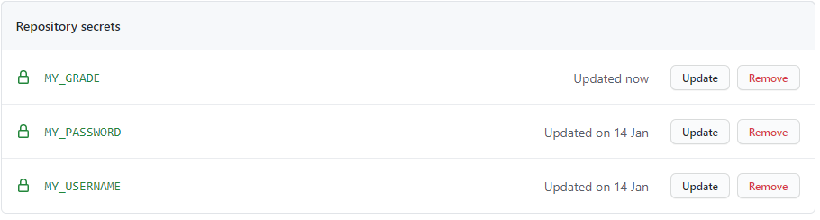
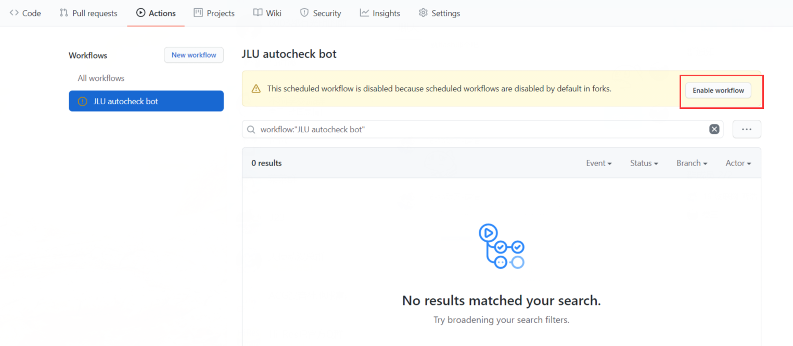

# jlu-health-report


吉林大学本科生/研究生自动健康打卡

- **自动获取并填入个人信息，无视打卡系统更新**
- **使用request直接发起请求，无需使用chromedriver**
- **Github Actions自助打卡**
- 定时自动打卡
- 支持多用户


# 使用方法

## 准备工作

**1. 安装脚本所需要的相关包文件**

```
pip install requests lxml bs4 schedule
```
**2. 克隆/下载本脚本**

直接点击页面右上角的绿色按钮`Code`进行下载

或者使用git命令

```
git clone https://github.com/gxywy/jlu-health-report.git
```


## 打卡

选择三种模式中的一种即可

**若打卡系统页面更新，只需手动在打卡页面填入并提交一次，之后即可重新运行打卡程序，无需对程序进行修改**

------


- **单用户脚本模式**

```
python main.py --user [YourUsername] --pwd [YourPassword] --grade [YJS/BKS]
```
其中，最后一个参数若不填写，默认为`YJS`

- **手动模式**

1. 填写`users.py`中一个或多个用户的用户名、密码、本科生/研究生（本科生填写`BKS`，研究生填写`YJS`）
2. 运行`main.py`

- **定时自动模式**

1. 填写`users.py`中一个或多个用户的用户名、密码、本科生/研究生（本科生填写`BKS`，研究生填写`YJS`）
2. 运行`auto.py`，需要常驻后台

# Github Actions（可选）

**2021.2.6 Github Actions已可正常使用，感谢[TychusLee](https://github.com/TychusLee)对相关bug的修复**

**2021.1.24 问题排查中，请关注后续更新**

本脚本支持使用Github Actions自助打卡，实现**无需本地常驻后台的自助打卡**

1. fork本repo

2. 点击`Settings->Secrets`，之后点击右上角的`New repository secret`添加3个secret

   

   第一个，`Name`字段中输入`MY_USERNAME`，`Value`字段中输入*你的用户名*

   第二个，`Name`字段中输入`MY_PASSWORD`，`Value`字段中输入*你的密码*

   第三个，`Name`字段中输入`MY_GRADE`，`Value`字段中输入`YJS`或`BKS` （若不填写，默认`YJS`）

6. 添加3个secrets后如图

   

7. 点击repo页面顶部的`Actions`，点击页面中的`Enable workflow`，启用工作流

   

9. 给fork后的repo(自己的repo)页面右上角点击`Star`来激活工作流

10. 最后点击repo页面顶部的`Actions`即可查看打卡记录和每日打卡情况

   

# 声明

⚠**当出现发烧等症状时需如实填报系统，不得使用本项目自动填报，否则产生的一切后果由用户本人承担。**

**本程序以你所见到的样子呈现给你，不附带任何明示或暗示的担保，包括但不限于对功能合法性或对特定用途适用性的保证。在运行之前，你有责任理解其源代码的工作原理，并确认这是你想要执行的，本程序进行的操作都应被视为你本人进行、或由你授权代你进行的操作。在任何情况下，本程序作者与你决定运行本程序无关，不为你运行此程序所造成的任何损失、受到的处罚以及造成的法律后果等负任何责任。**